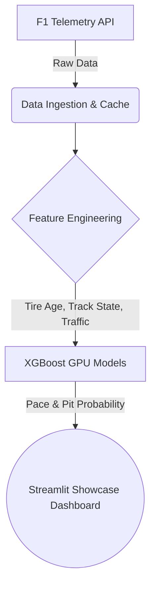

<div align="center">
  <h1>🏎️ PitPredict</h1>
  <p><b>AI-Powered Formula 1 Race Strategy & Telemetry Platform</b></p>
  <p><i>The pit wall, reimagined for everyone.</i></p>
</div>

---

## What is PitPredict?

PitPredict democratizes motorsport analytics. Modern F1 cars generate over 1.5 million data points per lap. We take that complex, high-volume telemetry data and translate it into interactive, real-time strategy recommendations.

Built on **XGBoost (GPU-Accelerated)** and **FastF1**, PitPredict models tire degradation lap-by-lap and predicts the optimal pit stop windows based on traffic density, track state, and driver aggressiveness.

---

## 🏗️ Simple Architecture

Our architecture is designed for speed, explainability, and visual impact.



---

## ✨ Features

- **Tire Degradation Modeling:** Predicts lap time decay based on tire compound and track conditions.
- **Pit Window Prediction:** Binary classification to output the exact probability of an optimal pit stop.
- **Undercut & Overcut Analysis:** Leverages Traffic Density (dirty air) and Pit Cost deltas.
- **Explainable AI (SHAP):** We refuse black-box models. PitPredict exposes the exact feature weights determining every strategy call.
- **Local GPU Acceleration:** Uses CUDA for lightning-fast training on local hardware.

---

## 🚀 How to Run the Showcase

We built a local **Streamlit Dashboard** so you can easily pull up the project for reviews and presentations without setting up complex REST APIs.

1. **Install Dependencies:**
   ```bash
   uv venv .venv --python 3.11
   uv pip install -r requirements.txt
   ```
2. **Run the Dashboard:**
   ```bash
   uv run streamlit run src/app.py
   ```

The dashboard will open automatically in your browser, load the cached models (or train them in seconds using your GPU), and present the interactive F1 strategy interface.
