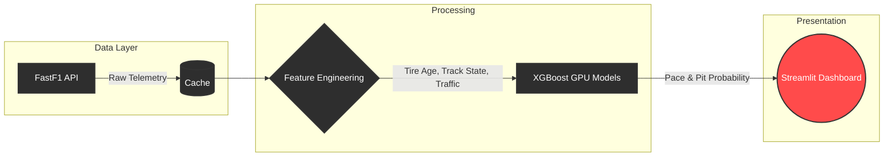

<div align="center">

<!-- Optional: Banner Image -->
<!--  -->

# 🏎️ PitPredict

**AI-Powered Formula 1 Race Strategy & Telemetry Platform**

*The pit wall, reimagined for everyone.*

[](https://www.python.org/downloads/)
[](https://streamlit.io)
[](https://xgboost.readthedocs.io/)
[](https://opensource.org/licenses/MIT)

</div>

<br />

## 🏁 What is PitPredict?

PitPredict democratizes motorsport analytics. Modern F1 cars generate over **1.5 million data points** per lap. We take that complex, high-volume telemetry data and translate it into interactive, real-time strategy recommendations.

Built on **XGBoost (GPU-Accelerated)** and **FastF1**, PitPredict models tire degradation lap-by-lap and predicts the optimal pit stop windows based on traffic density, track state, and driver aggressiveness.

---

## ✨ Key Features

| Feature | Description |
| :--- | :--- |
| 🛞 **Tire Degradation Modeling** | Predicts lap time decay based on tire compound, age, and track conditions. |
| 🛑 **Pit Window Prediction** | Binary classification to output the exact probability of an optimal pit stop. |
| 📊 **Undercut/Overcut Analysis** | Leverages Traffic Density (dirty air) and Pit Cost deltas. |
| 🧠 **Explainable AI (SHAP)** | We refuse black-box models. PitPredict exposes the exact feature weights determining every strategy call. |
| ⚡ **Local GPU Acceleration** | Uses CUDA for lightning-fast training on local hardware. |

---

## 🏗️ Architecture Overview

Our architecture is designed for speed, explainability, and visual impact.



---

## 🚀 Quick Start

We built a local **Streamlit Dashboard** so you can easily pull up the project for reviews and presentations without setting up complex REST APIs.

### Prerequisites
- Python 3.11+
- CUDA Toolkit (Optional, for GPU acceleration)
- [`uv`](https://github.com/astral-sh/uv) package manager (Recommended)

### Installation & Run

1. **Clone & Install Dependencies**
   ```bash
   # Create a virtual environment and install dependencies
   uv venv .venv --python 3.11
   uv pip install -r requirements.txt
   ```

2. **Launch the Dashboard**
   ```bash
   # Start the Streamlit application
   uv run streamlit run src/app.py
   ```

> 💡 **Tip:** The dashboard will open automatically in your browser. It will load cached models or train them in seconds using your GPU, presenting you with the interactive F1 strategy interface.

---

<div align="center">
  <i>Built with passion for the race. 🏎️💨</i>
</div>
