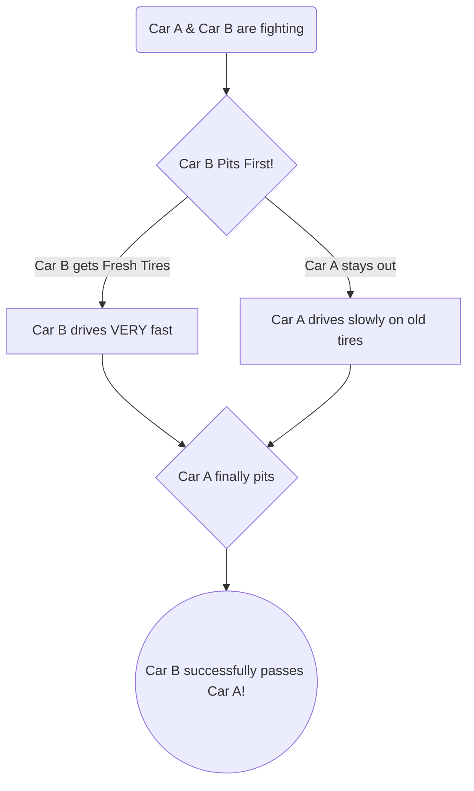

  <h1>🏎️ PitPredict: The Non-Fan's Guide</h1>
  
<b>Understanding the Math and Machine Learning Behind Formula 1</b>

---

## 1. What is Formula 1?

Formula 1 (F1) is a global motorsport where drivers race highly advanced cars around circuits at speeds over 200 mph. 

While it might look like a simple driving competition on the surface, F1 is actually an incredibly complex **math and strategy game** played by hundreds of engineers sitting behind computer screens. 

## 2. The Core Problem: The Tires

The most important part of an F1 car is its tires. Because the cars drive so fast, the rubber on the tires literally melts and wears away. This is called **Tire Degradation**.

Here is the dilemma every team faces:
- **Fresh Tires:** Very fast, lots of grip.
- **Old Tires:** Very slow, worn out, slippery.

When a driver's tires get too old and slow, they must drive into the "Pit Lane" to have mechanics bolt on a fresh set of tires. This is called a **Pit Stop**.

However, driving through the pit lane takes roughly **22 seconds**.

## 3. The Strategy Game

The ultimate game of F1 is answering one question: **When is the mathematical perfect moment to sacrifice 22 seconds for a pit stop?**

- If you pit **too early**, you will have to drive for too long on your next set of tires, and they will wear out before the end of the race.
- If you pit **too late**, your current tires will become so slow that the cars behind you will catch up and pass you.

### The "Undercut"
The most famous strategic move is the "Undercut." This happens when two drivers are fighting for position. The driver behind decides to pit *first*. They get fresh, incredibly fast tires. While the driver in front stays out on old, slow tires, the driver behind uses their fresh tires to completely erase the gap between them. When the driver in front finally pits a lap later, they emerge *behind* their rival!

## 4. What PitPredict Does

During a race, F1 cars generate **1.5 million data points per lap**. Human brains cannot calculate the perfect pit stop time using that much data in real-time.

**PitPredict** uses Machine Learning (AI) to do the math instantly:

1. **The XGBoost AI:** It looks at the weather, the track temperature, how aggressively the driver is driving, and the traffic on the track. It then predicts *exactly* when the tire will "fall off a cliff" (become too slow).
2. **The Pit Simulator:** It calculates the exact 22-second penalty and tells you if an "Undercut" will succeed or fail.
3. **The AI Race Engineer:** We hooked up Google's **Gemini AI** to the raw math. Gemini acts as a virtual coach, looking at the complex data and translating it into a simple, spoken sentence (e.g., *"Your tires are dying, pit now!"*).

In short, PitPredict is a platform that takes the multimillion-dollar data science tools used by actual F1 teams and makes them interactive and accessible for anyone.

## 5. The Academic Science Behind It (Literature Review)

If you're wondering if this is actual science or just a game, it is deeply rooted in academic research! 

Historically, motorsport strategy has been studied through **Game Theory** (e.g., *Is the car behind me going to pit, and if so, how should I react?*). More recently, research papers have proven that tire degradation can be modeled using advanced mathematical frameworks like **State-Space Models** and **Recurrent Neural Networks (RNNs)**. 

PitPredict builds heavily on this academic foundation. However, rather than using opaque "black-box" neural networks that are hard to interpret, we consciously chose **Gradient Boosted Decision Trees (XGBoost)**. As highlighted in modern ML literature, XGBoost provides top-tier predictive accuracy while maintaining *explainability*. This means we don't just know *when* a driver should pit; we can trace the math back to know *exactly why* (e.g., track temperature dropped by 2 degrees, causing a loss of grip).
