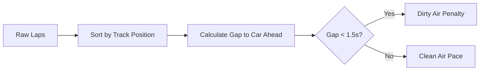

# Machine Learning Concepts in PitPredict

This document outlines the Machine Learning architectures, methodologies, and datasets that power the **PitPredict** platform.

## 1. Datasets & Ingestion

PitPredict relies on the **FastF1** Python API, which interfaces with the official Formula 1 live timing and telemetry services.

### Data Acquisition Process
1. **Session Fetching:** The system queries FastF1 for specific Grand Prix sessions (e.g., 2023 Spanish GP Race).
2. **Lap Logging:** We extract lap-by-lap summaries for every driver, including sector times, pit in/out timestamps, and tire compounds.
3. **Telemetry & Weather:** We merge high-frequency weather telemetry (Air Temperature, Track Temperature, Rainfall) with the lap logs using `pandas.merge_asof` on the time deltas.
4. **Caching:** Raw session data is heavily cached locally in SQLite/pickles to prevent API rate limiting and reduce model retraining latency.

## 2. Feature Engineering & New Parameters

Raw telemetry is transformed into tabular ML-ready features. We've recently added advanced metrics to capture true racing dynamics:

- `Tire_Age`: Cumulative laps completed on the current set of tires.
- `Compound_Encoded`: Categorical mapping (Soft, Medium, Hard, etc.).
- `Lap_Delta`: Momentum indicator representing pace difference from the previous lap.
- `Pace_Volatility` (Driver Aggressiveness): Rolling standard deviation of lap deltas. Higher volatility damages tires faster.
- `Track_State`: Cumulative metric combining lap number and track temperature to represent rubber laying down on the circuit.
- `Gap_to_Car_Ahead`: True track position gap simulated via session elapsed time.
- `In_Dirty_Air` (Traffic Density): Binary flag if the car is within 1.5 seconds of the car ahead, triggering aerodynamic penalties.
- `Pit_Cost_Delta`: A constant representing the average time lost in the pit lane (e.g., 22 seconds), crucial for determining Undercuts/Overcuts.

## 3. Dual-Model ML Architecture

PitPredict uses a dual-model approach utilizing **Extreme Gradient Boosting (XGBoost)**.

### Model A: Tire Degradation (XGBRegressor)
- **Objective:** Predict the absolute or normalized lap time for a driver on a given lap.
- **Concept:** This is a **Regression** task. As `Tire_Age` increases, the predicted lap time should ideally curve upwards.
- **Handling Outliers:** We explicitly filter out "Pit-In" and "Pit-Out" laps from the training set, as these are anomalies (20-30s slower) that would distort the pace degradation curve.
- **Metrics:** Evaluated using Mean Absolute Error (MAE) and R² Score.

### Model B: Pit Stop Classifier (XGBClassifier)
- **Objective:** Predict whether a driver will pit at the end of the current lap.
- **Concept:** This is a **Binary Classification** task. The dataset is highly imbalanced (a driver pits only 1-3 times in a 60-lap race).
- **Handling Imbalance:** We evaluate the model using **Precision, Recall, and F1 Score**, rather than Accuracy. A naive model that predicts "No Pit" for every lap achieves ~97% accuracy, which is highly misleading.
- **Output:** The model outputs a probability distribution (0.0 to 1.0). When the probability spikes, the "Pit Window" is open.

## 4. Model Explainability

We refuse black-box modeling. By utilizing tree-based boosting, we extract **Feature Importances**:
- **Gain / Weight:** Shows which variables (e.g., `Tire_Age` vs `TrackTemp`) provide the most information split across all decision trees.
- In future iterations, we plan to implement **SHAP (SHapley Additive exPlanations)** values to provide localized, per-lap explanations for why a pit stop was triggered.
